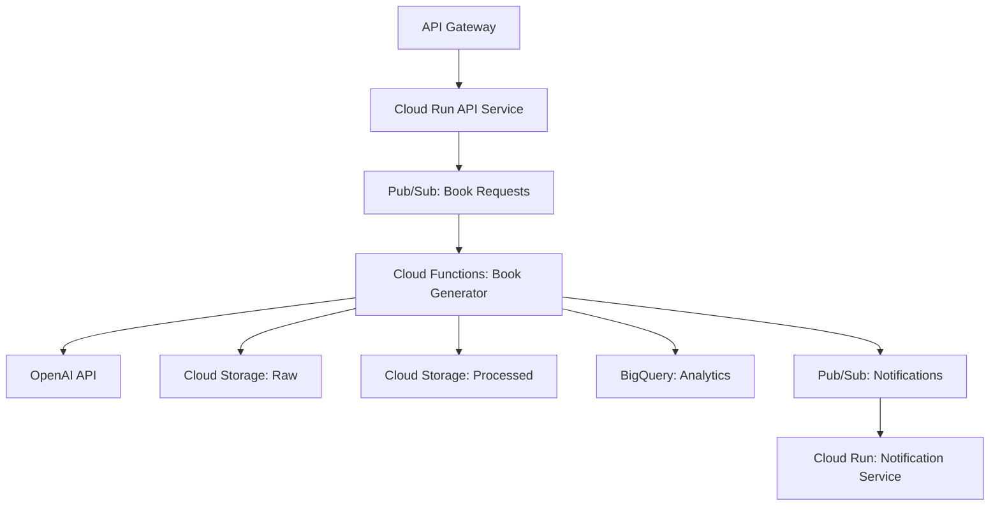

# Cloud Book Generator 5.0 🚀

A state-of-the-art cloud-native system for generating personalized books at scale using OpenAI and Google Cloud Platform's latest features.

## 🌟 Key Features

- **Serverless Architecture**: Fully cloud-native using GCP's latest services
- **AI-Powered Generation**: Advanced book creation using OpenAI's GPT-4 models
- **Real-time Processing**: Event-driven architecture with Pub/Sub
- **Scalable Data Lake**: Multi-layer data storage with GCS
- **Advanced Analytics**: Real-time insights with BigQuery
- **Cost Optimization**: Batch processing for optimal resource usage
- **Global Distribution**: Cloud CDN integration for content delivery

## 🏗️ Architecture



## 🚀 Getting Started

### Prerequisites

- GCP Project with billing enabled
- OpenAI API access
- Terraform installed
- gcloud CLI configured

### Quick Start

1. **Enable APIs**:
```bash
gcloud services enable \
    cloudfunctions.googleapis.com \
    run.googleapis.com \
    pubsub.googleapis.com \
    bigquery.googleapis.com \
    secretmanager.googleapis.com \
    artifactregistry.googleapis.com
```

2. **Set Environment**:
```bash
export PROJECT_ID="your-project-id"
export REGION="us-central1"
```

3. **Deploy Infrastructure**:
```bash
cd terraform
terraform init
terraform apply
```

4. **Deploy Services**:
```bash
# Build and deploy API
gcloud builds submit api/ --tag gcr.io/$PROJECT_ID/book-api
gcloud run deploy book-api --image gcr.io/$PROJECT_ID/book-api

# Deploy processor
gcloud functions deploy book-processor \
    --runtime python310 \
    --trigger-topic book-requests
```

## 📚 System Components

### 1. API Layer (Cloud Run)
- RESTful API endpoints
- Authentication & rate limiting
- Request validation
- Load balancing

### 2. Book Generation (Cloud Functions)
- OpenAI integration
- Content customization
- Error handling
- Retry mechanisms

### 3. Data Lake (Cloud Storage)
- Raw data storage
- Processed content
- Asset management
- Version control

### 4. Analytics (BigQuery)
- Generation metrics
- Usage patterns
- Performance analytics
- Cost analysis

## 📊 Monitoring & Analytics

Access built-in dashboards for:
- Generation success rates
- Processing times
- Token usage
- Cost metrics
- User patterns

## 🔧 Advanced Configuration

### Scaling Parameters
```yaml
cpu: 2
memory: 2Gi
max_instances: 100
concurrency: 80
timeout: 300s
```

### Security Settings
```yaml
vpc_connector: enabled
cloud_armor: enabled
private_access: true
encryption: cmek
```

## 📈 Performance Optimization

The system includes:
- Automatic batch processing
- Smart caching
- Content optimization
- Resource auto-scaling
- Load balancing

## 🛡️ Security Features

- Cloud IAM integration
- Secret Manager for credentials
- VPC Service Controls
- Cloud Armor protection
- Data encryption at rest and in transit

## 💡 Best Practices

1. **Content Generation**:
   - Use batching for bulk processing
   - Implement retry mechanisms
   - Cache frequent requests
   - Validate inputs thoroughly

2. **Data Management**:
   - Implement data lifecycle policies
   - Use appropriate storage classes
   - Regular backup and recovery testing
   - Monitor storage costs

3. **Monitoring**:
   - Set up alerting
   - Monitor key metrics
   - Regular performance reviews
   - Cost optimization checks

## 📝 License

MIT

## 🤝 Contributing

See [CONTRIBUTING.md](CONTRIBUTING.md) for details.